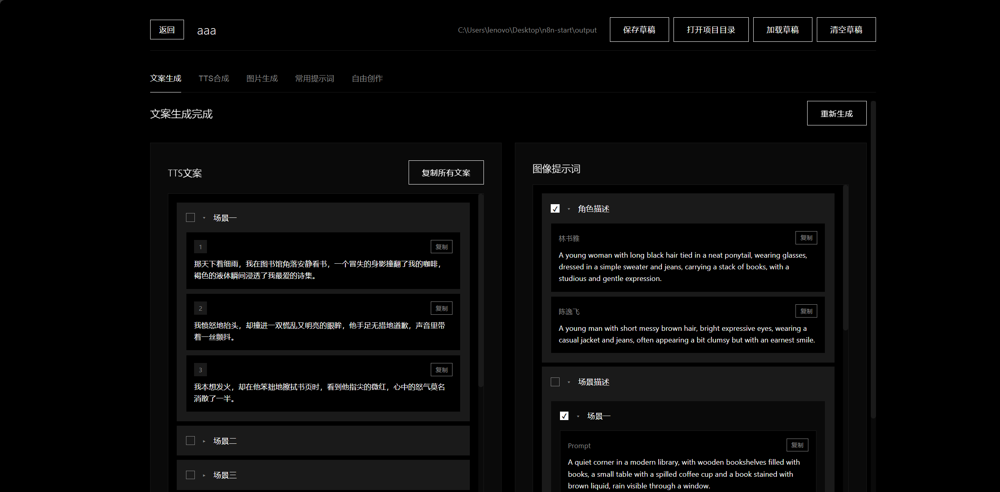
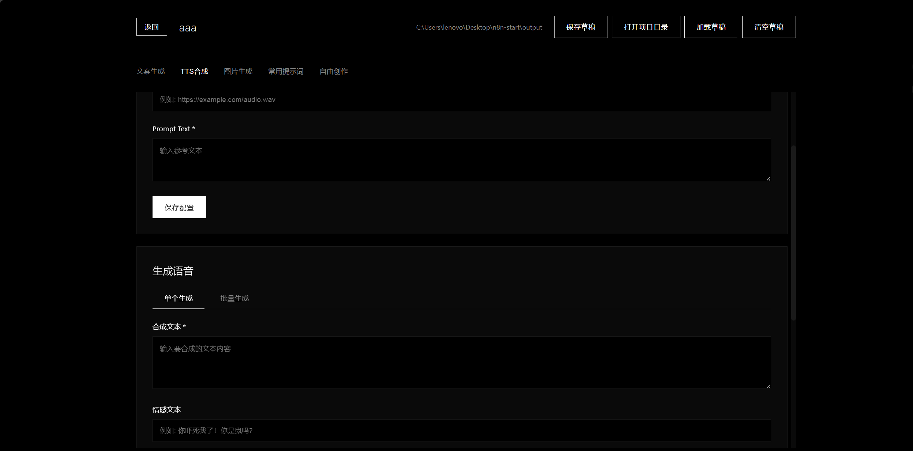
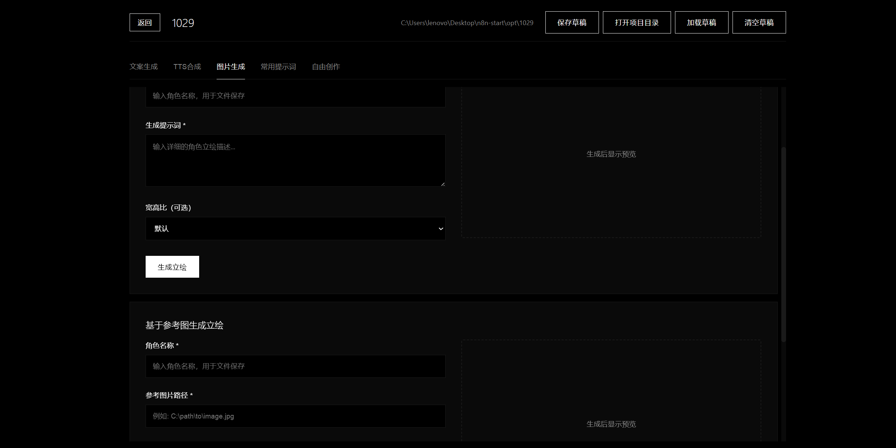
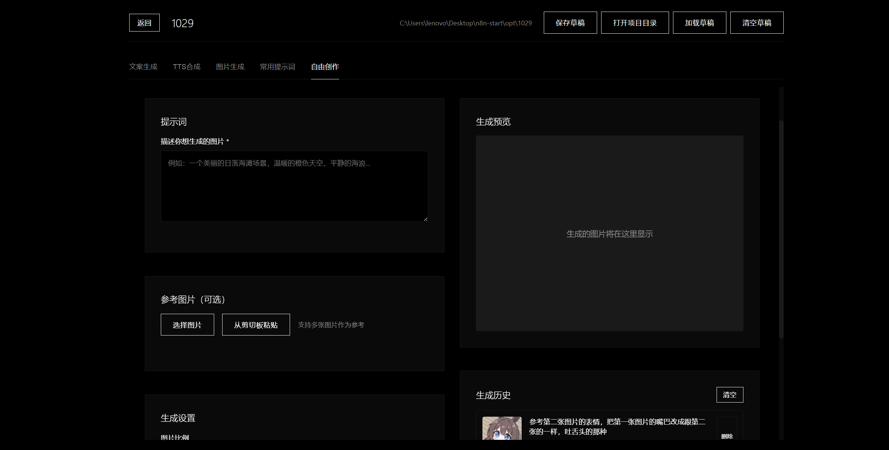

# Video Material GEN Workstation

一个集内容策划、AI文案自动生成、TTS 批量自动配音、(AI)图片素材合成、ASR自动提取语言字幕脚本、AI自由创作于一体的(短视频)生成工作站。方便管理每期的视频项目。

## 功能速览

- 支持按模板批量生成视频项目，脚本、图片素材(AI)、字幕和音频一键齐备。
- Gemini + TTS合成，既能改写脚本又能直接输出(带情绪的)配音。
- 图文分轨管理，可在前端随时替换图片、字幕或音频并预览结果。

## 数据展示

## 前端界面

## 快速上手

1. 复制 `env.example.yaml` 为 `env.yaml`，填入自己的 Gemini Key、Base URL、模型、TTS Key 与提示词等配置，否则无法调用接口。
2. （可选）在 `env.yaml` 中设置 `Default-Project-Root`，用于存放自动生成的脚本、音频与图片文件。
3. 安装依赖：`npm install`。
4. 启动服务：`npm start` 或直接双击 `start.bat`，默认访问地址为 `http://localhost:8765`。

## 功能介绍

1. **项目总览**：以卡片形式管理批量项目，显示输出目录、创建时间及删除动作，便于快速定位。
2. **文案生成**：结构化展示场景脚本，可复制单条或整段文案，左侧勾选联动右侧提示词。
3. **TTS 合成**：支持单条与批量两种模式，输入合成文本与情感提示即可生成语音。
4. **图片生成**：集中管理角色描述、场景描述等提示词，勾选后即可批量复制到绘图任务。
5. **立绘/背景等生成**：提供提示词输入、参考图上传、宽高比设置与历史记录，方便随时复用素材。
6. **逆向接口实现ASR自动提取剪辑需要的字幕文件**：在TTS合成界面下方，有“字幕生成”功能，点击下方的按钮可以打开字幕生成工具。此部分代码由其它作者开源。
7. **常用提示词与自由创作**：收藏高频提示词并一键复制，同时提供自由创作面板进行自定义绘制。

### 其它功能我就懒得一个一个写了，具体有啥自己可以部署一下去玩，注意文案生成这里需要配合n8n来操作，之前写的n8n文件找不到了，所以这部分其实可以忽略，主要就是一个用于生成文案的脚本AI提示词以及我主页另一个仓库中有的一个开源的B站视频字幕提取器（当然网上也有）（参考别人高播放的视频自己学起来也会快很多）

## 接下来如何好好利用这个项目还是得靠自己。
### 因为主要还是偏向管理用的（简单来讲就是功能不会有你想象的那么实用），视频内容如何定义，如何打造爆款还是需要动脑子。当然本项目里面使用图像编辑模型的是NanoBanana，本地部署的AIStudio的反向代理的接口，用来生图然后给Sora也是不错的，起码测试下来比较稳定。

## 免责声明

### 项目仅共参考交流学习使用，不对任何使用者产生的问题负责

